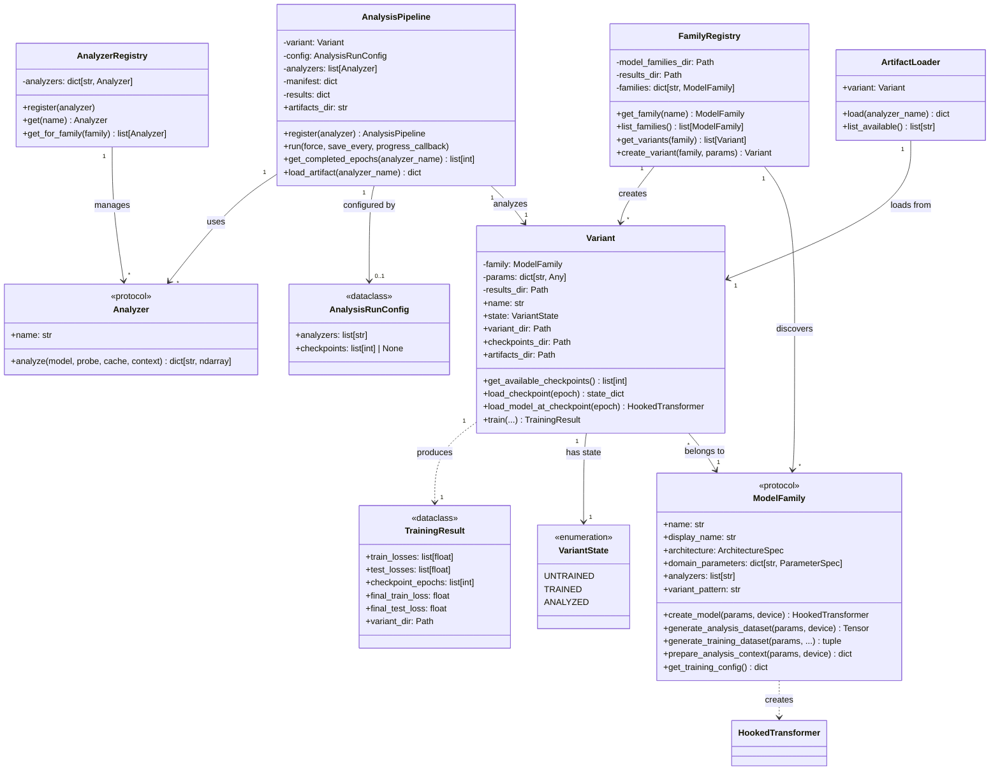

# Domain Model

This document describes the core domain objects and their relationships in the Training Dynamics Workbench.

## Class Diagram

## Core Concepts

### ModelFamily
A **ModelFamily** groups structurally similar models that share architecture, valid analyzers, and analysis dataset schema. Families are defined by `family.json` files in `model_families/`. The family is responsible for creating models and generating datasets.

### Variant
A **Variant** is a specific trained instance within a family, characterized by domain parameters (e.g., `prime=113, seed=42`). Each variant manages its own checkpoints and analysis artifacts directories.

### The Scientific Invariant
For meaningful analysis across training, the pipeline enforces: **same Variant + same Probe, only checkpoint varies**. This ensures all analysis outputs are directly comparable.

### Probe (Analysis Dataset)
The input tensor used for analysis forward passes. Generated by the family for a specific variant's parameters. The same probe is used across all checkpoints.

### Analyzer
Computes analysis on a single checkpoint, receiving model, probe, activation cache, and family-provided context. Returns numpy arrays that become artifacts.

### AnalysisPipeline
Orchestrates analysis across checkpoints, enforcing the Scientific Invariant. Manages artifact persistence and resumability.

## Vocabulary Evolution (Under Consideration)

| Current | Proposed | Rationale |
|---------|----------|-----------|
| `Variant` | `ModelVariant` | Clarifies it's a model instantiation |
| `Probe` | `VariantProbe` | Ties the probe to its variant |
| (epoch int) | `VariantCheckpoint` | First-class checkpoint identity |
