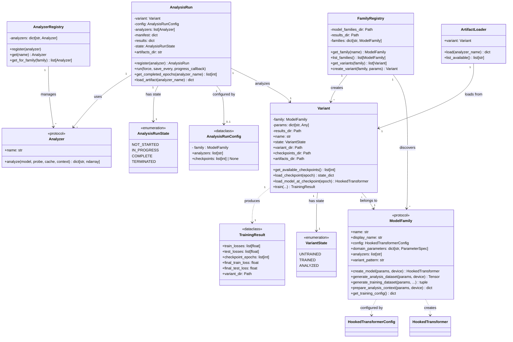

# Domain Model

This document describes the core domain objects and their relationships in the Training Dynamics Workbench.

## Class Diagram

## Core Concepts

### ModelRegistry
Class for creating new and loading existing ModelFamily instances.

### ModelFamily
A **ModelFamily** is a declared grouping of models that share architecture, valid analyzers, and visualizations. Examples: "Modulo Addition 1-Layer", "Indirect Object Identification". Families are defined by `family.json` files in `model_families/`. The family is responsible for creating models and definining analysis and visualization sets that are useful across variants. Families are explicitly registered because what constitutes "structurally similar" is learned over time by the researcher.

### Model Variant
A **Model Variant** is a specific trained model within a family. Variants share architecture and analysis logic but differ in domain parameters. In the "Modulo Addition 1-Layer" example, a Model Variant would be a model trainined on a different Modulus or Seed value without changing any of the model architecture. Model Variants are meant to allow researchers to explore how small changes to task definitions and seed values affect training dynamics. Each variant manages its own checkpoints and analysis artifacts directories. Each variant maintains its own list of Probe datasets.

Variant training results metadata is stored in `results/{model name}/{variant name}/metadata.json`. Variant checkpoints are stored under `results/{model name}/{variant name}/checkpoints/` as `safetensor` files with the name `checkpoint_epoch_{epoch number}.safetensors`. Checkpoint files are saved at each configured checkpoint instead of storing in memory.

### Probe
The input data used by a Model Family during analysis forward passes. For small toy models, this might be one canonical dataset (e.g., full (a, b) grid for Modulo Addition). For larger models, a Model Family may contain many smaller probes that exercise behaviors of interest. Probe design is part of the research for larger models.

### AnalyzerRegistry
Class for creating new and loading existing Analyzer instances.

### Analyzer
A module responsible for generating analysis data given a Model Variant Checkpoint and its activation cache. Computes a single analysis function and returns numpy arrays as analysis artifacts.

Analyzers are defined by 'analyzer.json' in `analyzers/`.

### AnalysisRun
Orchestrates analysis across a model variant's checkpoints given a list of analysis functions. Manages artifact persistence and resumability.
The workbench focuses on analysis runs instead of training runs. The goal is to optimize the ability to analyze models across training checkpoints instead of optimizing models themselves. Analysis Runs orchestrate the creation of analysis dataset artifacts. The Analysis Run is reponsible for loading checkpoints of a Model Variant, executing forward passes through each checkpoint, passing the output of the forward pass and activation cache to each Analyzer defined in the run.

Analyzer results for a given AnalysisRun are stored under `results/{model name}/{variant name}/analysis/` as `npz` files. Completed analyses are logged in `manifest.json` in `results/{model name}/{variant name}/analysis/`.
