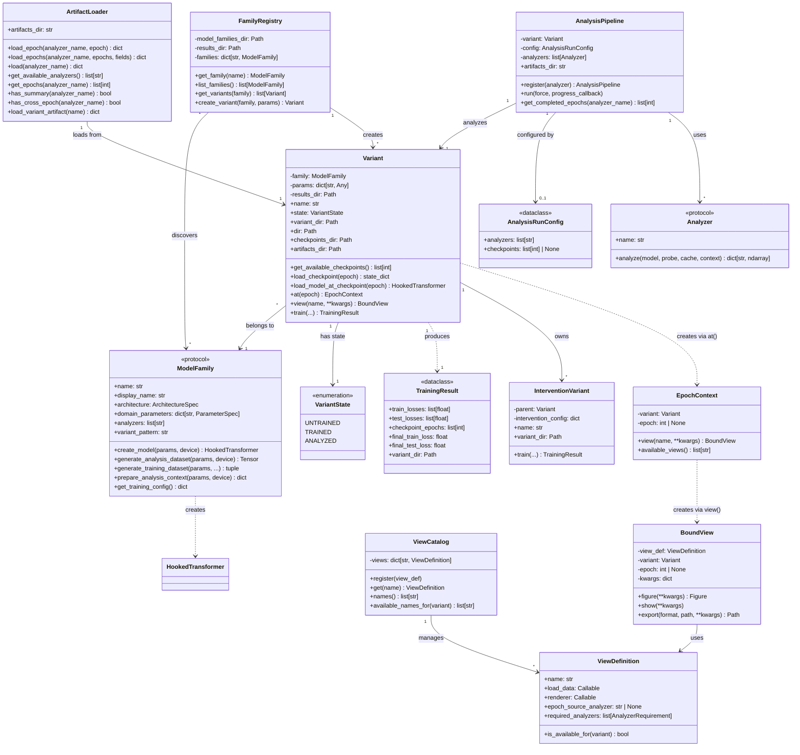

# Domain Model

This document describes the core domain objects and their relationships in the Training Dynamics Workbench.

## Class Diagram


```mermaid
classDiagram
    direction TB

    class FamilyRegistry {
        -model_families_dir: Path
        -results_dir: Path
        -families: dict[str, ModelFamily]
        +get_family(name) ModelFamily
        +list_families() list[ModelFamily]
        +get_variants(family) list[Variant]
        +create_variant(family, params) Variant
    }

    class ModelFamily {
        <<protocol>>
        +name: str
        +display_name: str
        +architecture: ArchitectureSpec
        +domain_parameters: dict[str, ParameterSpec]
        +analyzers: list[str]
        +variant_pattern: str
        +create_model(params, device) HookedTransformer
        +generate_analysis_dataset(params, device) Tensor
        +generate_training_dataset(params, ...) tuple
        +prepare_analysis_context(params, device) dict
        +get_training_config() dict
    }

    class Variant {
        -family: ModelFamily
        -params: dict[str, Any]
        -results_dir: Path
        +name: str
        +state: VariantState
        +variant_dir: Path
        +dir: Path
        +checkpoints_dir: Path
        +artifacts_dir: Path
        +get_available_checkpoints() list[int]
        +load_checkpoint(epoch) state_dict
        +load_model_at_checkpoint(epoch) HookedTransformer
        +at(epoch) EpochContext
        +view(name, **kwargs) BoundView
        +train(...) TrainingResult
    }

    class InterventionVariant {
        -parent: Variant
        -intervention_config: dict
        +name: str
        +variant_dir: Path
        +train(...) TrainingResult
    }

    class VariantState {
        <<enumeration>>
        UNTRAINED
        TRAINED
        ANALYZED
    }

    class EpochContext {
        -variant: Variant
        -epoch: int | None
        +view(name, **kwargs) BoundView
        +available_views() list[str]
    }

    class BoundView {
        -view_def: ViewDefinition
        -variant: Variant
        -epoch: int | None
        -kwargs: dict
        +figure(**kwargs) Figure
        +show(**kwargs)
        +export(format, path, **kwargs) Path
    }

    class ViewDefinition {
        +name: str
        +load_data: Callable
        +renderer: Callable
        +epoch_source_analyzer: str | None
        +required_analyzers: list[AnalyzerRequirement]
        +is_available_for(variant) bool
    }

    class ViewCatalog {
        -views: dict[str, ViewDefinition]
        +register(view_def)
        +get(name) ViewDefinition
        +names() list[str]
        +available_names_for(variant) list[str]
    }

    class AnalysisPipeline {
        -variant: Variant
        -config: AnalysisRunConfig
        -analyzers: list[Analyzer]
        +artifacts_dir: str
        +register(analyzer) AnalysisPipeline
        +run(force, progress_callback)
        +get_completed_epochs(analyzer_name) list[int]
    }

    class AnalysisRunConfig {
        <<dataclass>>
        +analyzers: list[str]
        +checkpoints: list[int] | None
    }

    class Analyzer {
        <<protocol>>
        +name: str
        +analyze(model, probe, cache, context) dict[str, ndarray]
    }

    class ArtifactLoader {
        +artifacts_dir: str
        +load_epoch(analyzer_name, epoch) dict
        +load_epochs(analyzer_name, epochs, fields) dict
        +load(analyzer_name) dict
        +get_available_analyzers() list[str]
        +get_epochs(analyzer_name) list[int]
        +has_summary(analyzer_name) bool
        +has_cross_epoch(analyzer_name) bool
        +load_variant_artifact(name) dict
    }

    class TrainingResult {
        <<dataclass>>
        +train_losses: list[float]
        +test_losses: list[float]
        +checkpoint_epochs: list[int]
        +final_train_loss: float
        +final_test_loss: float
        +variant_dir: Path
    }

    %% Relationships
    FamilyRegistry "1" --> "*" ModelFamily : discovers
    FamilyRegistry "1" --> "*" Variant : creates
    Variant "*" --> "1" ModelFamily : belongs to
    Variant "1" --> "1" VariantState : has state
    Variant "1" ..> "1" TrainingResult : produces
    Variant "1" --> "*" InterventionVariant : owns

    Variant ..> EpochContext : creates via at()
    EpochContext ..> BoundView : creates via view()
    BoundView --> ViewDefinition : uses
    ViewCatalog "1" --> "*" ViewDefinition : manages

    AnalysisPipeline "1" --> "1" Variant : analyzes
    AnalysisPipeline "1" --> "0..1" AnalysisRunConfig : configured by
    AnalysisPipeline "1" --> "*" Analyzer : uses

    ArtifactLoader "1" --> "1" Variant : loads from

    ModelFamily ..> HookedTransformer : creates
```

## Core Concepts

### FamilyRegistry
Discovers and manages `ModelFamily` instances from the `model_families/` directory. Each subdirectory containing a `family.json` is registered as a family. The registry also creates `Variant` objects by combining a family with specific domain parameter values.

### ModelFamily
A **ModelFamily** is a declared grouping of models that share architecture, valid analyzers, and domain context. Examples: "Modulo Addition 1-Layer". Families are defined by `family.json` files in `model_families/`. The family is responsible for creating models, constructing analysis probes, and providing interpretive context (e.g., a Fourier basis for modular arithmetic). Families are explicitly registered because what constitutes "structurally similar" is a research judgment, not an automatic inference.

**Architectural invariant:** Families are context providers, not view owners. Analytical views are universal instruments that apply to any transformer — they are not registered or owned by a family.

### Variant
A **Variant** is a specific trained model within a family. Variants share architecture and analysis logic but differ in domain parameters (e.g., modulus, model seed, data seed). Each variant manages its own checkpoints and analysis artifacts directories.

Key access patterns:
- `variant.dir` — path to the variant's working directory
- `variant.at(epoch)` — returns an `EpochContext` for view access
- `variant.view("view_name", **kwargs)` — shortcut for `variant.at(None).view(name, **kwargs)`
- `variant.artifacts` — returns an `ArtifactLoader` for direct artifact access

Variant training metadata is stored at `results/{family}/{variant}/metadata.json`. Checkpoints are stored under `results/{family}/{variant}/checkpoints/` as `.safetensors` files.

### InterventionVariant
A **sub-variant** nested under a parent `Variant`. Represents a targeted experiment — training the same architecture with a forward hook active during a specified epoch window. Stored under `results/{family}/{parent_variant}/interventions/{label}/`. Discovered via `variant.interventions`.

### Probe
The input data used during analysis forward passes. For the Modulo Addition family, this is the full (a, b) input grid. Probe design is a research concern for larger models where exhaustive input grids are infeasible.

### Analyzer
A module responsible for generating analysis data from a model checkpoint and its activation cache. Computes a single analysis function and returns NumPy arrays as artifacts.

Three tiers:
- **Per-epoch analyzers** — run independently against each checkpoint (e.g., `neuron_freq_norm`, `parameter_snapshot`)
- **Cross-epoch analyzers** — run once across the full checkpoint sequence to compute trajectories (e.g., `parameter_trajectory`, `neuron_dynamics`)
- **Secondary analyzers** — derived from existing artifacts without loading model weights (e.g., `neuron_fourier`)

### AnalysisPipeline
Orchestrates analysis across a variant's checkpoints. Loads checkpoints, runs forward passes, and dispatches to each registered analyzer. Artifact persistence and resumability are built in — already-computed epochs are skipped automatically.

Artifacts are stored per-epoch at: `results/{family}/{variant}/artifacts/{analyzer}/epoch_{NNNNN}.npz`

Non-epoch-keyed artifacts (e.g., cross-epoch) are stored at: `results/{family}/{variant}/artifacts/{analyzer}/{analyzer}.npz`

### ArtifactLoader
Handles all artifact I/O for a specific variant. Supports single-epoch loading (`load_epoch`), stacked multi-epoch loading (`load_epochs`, `load`), and non-epoch-keyed artifacts (`load_variant_artifact`). The `fields=` parameter on `load_epochs` enables selective field loading to avoid loading large artifacts unnecessarily.

### View Catalog
The research interface for visualizations. Three layers:

- **`ViewDefinition`** — pairs a `load_data` function with a `renderer` function for a named view
- **`ViewCatalog`** — global registry of all named views (populated on import of `miscope.views.universal`)
- **`EpochContext`** — pins a variant + epoch, returned by `variant.at(epoch)`
- **`BoundView`** — a view with variant and epoch already bound; exposes `.show()`, `.figure()`, `.export()`

Usage:
```python
# Full form
ctx = variant.at(epoch=5000)
ctx.view("parameters.pca.trajectory").show()

# With view-level kwargs
variant.view("neuron.freq.distribution", site="mlp_post").show()

# kwargs merge: view-level kwargs are base, call-site kwargs take precedence
bound = variant.view("repr.geometry.centroid_pca", site="attn_out")
fig = bound.figure(prime=7)  # site from view(), prime from figure()
```

All views are universal — they apply to any transformer variant regardless of family.
