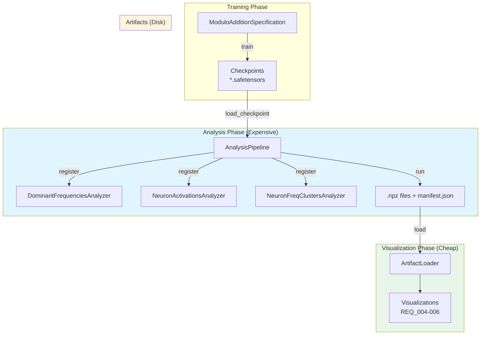

# Analysis Pipeline

The analysis package provides a modular pipeline for computing and persisting analysis artifacts from model checkpoints.

## Architecture Overview



## Key Concepts

### Separation of Concerns

The pipeline separates **expensive computation** from **cheap visualization**:

1. **Analysis Phase**: Load checkpoints, run forward passes, compute features → save artifacts
2. **Visualization Phase**: Load artifacts, apply visual parameters, display → iterate quickly

This enables fast iteration on visualizations without re-running expensive computations.

### Analyzer Protocol

Analyzers implement a simple protocol:

```python
class Analyzer(Protocol):
    @property
    def name(self) -> str: ...

    def analyze(self, model, dataset, cache, fourier_basis) -> dict[str, np.ndarray]: ...
```

### Resumability

The pipeline tracks completed epochs in `manifest.json`. Re-running analysis skips already-computed checkpoints unless `force=True`.

## Usage

### Running Analysis

```python
from analysis import AnalysisPipeline
from analysis.analyzers import (
    DominantFrequenciesAnalyzer,
    NeuronActivationsAnalyzer,
    NeuronFreqClustersAnalyzer,
)

# Create pipeline
pipeline = AnalysisPipeline(model_spec)

# Register analyzers
pipeline.register(DominantFrequenciesAnalyzer())
pipeline.register(NeuronActivationsAnalyzer())
pipeline.register(NeuronFreqClustersAnalyzer())

# Run analysis (skips existing artifacts)
pipeline.run()

# Or force recompute
pipeline.run(force=True)

# Or analyze specific epochs
pipeline.run(epochs=[0, 1000, 5000])
```

### Loading Artifacts (Visualization Layer)

```python
from analysis import ArtifactLoader

# Standalone loader - no pipeline needed
loader = ArtifactLoader("/path/to/artifacts")

# List available analyzers
print(loader.get_available_analyzers())
# ['dominant_frequencies', 'neuron_activations', 'neuron_freq_norm']

# Load artifact
artifact = loader.load("dominant_frequencies")
print(artifact["epochs"])        # [0, 100, 200, ...]
print(artifact["coefficients"])  # (n_epochs, n_components)

# Get metadata
metadata = loader.get_metadata("dominant_frequencies")
print(metadata["shapes"])  # {'coefficients': [46, 114]}
```

## Package Structure

```
analysis/
  __init__.py              # Exports Analyzer, AnalysisPipeline, ArtifactLoader
  protocols.py             # Analyzer Protocol definition
  pipeline.py              # AnalysisPipeline orchestrator
  artifact_loader.py       # Standalone artifact loading
  analyzers/
    __init__.py
    dominant_frequencies.py  # Fourier coefficient norms
    neuron_activations.py    # MLP activation heatmaps
    neuron_freq_clusters.py  # Neuron-frequency specialization
```

## Artifacts Produced

| Artifact | Shape | Description |
|----------|-------|-------------|
| `dominant_frequencies.npz` | (n_epochs, n_components) | Fourier coefficient norms for embeddings |
| `neuron_activations.npz` | (n_epochs, d_mlp, p, p) | MLP activations reshaped to input space |
| `neuron_freq_norm.npz` | (n_epochs, p//2, d_mlp) | Fraction of variance explained by each frequency |
| `manifest.json` | - | Completion tracking and metadata |

## Adding a New Analyzer

1. Create a new file in `analyzers/`
2. Implement the `Analyzer` protocol:

```python
class MyAnalyzer:
    @property
    def name(self) -> str:
        return "my_analyzer"

    def analyze(self, model, dataset, cache, fourier_basis) -> dict[str, np.ndarray]:
        # Your analysis logic here
        result = ...
        return {"data": result.detach().cpu().numpy()}
```

3. Export from `analyzers/__init__.py`
4. Register with the pipeline
